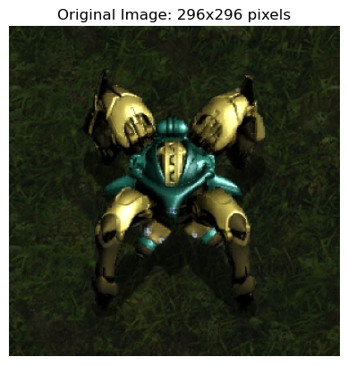
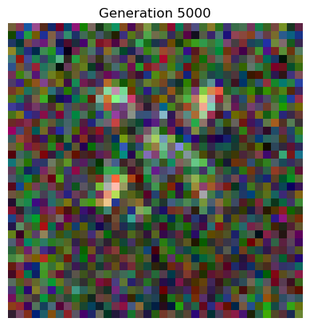
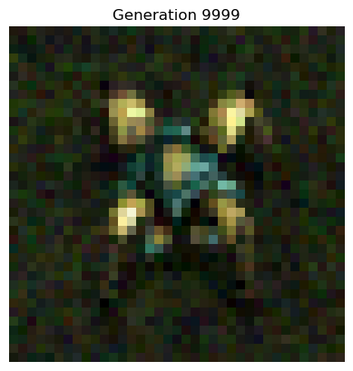
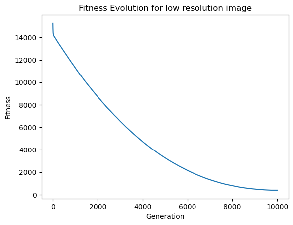
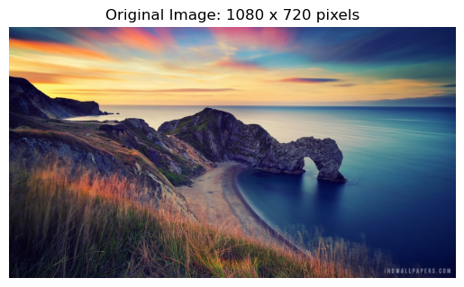
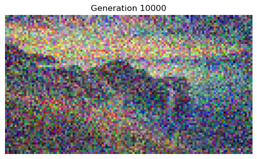
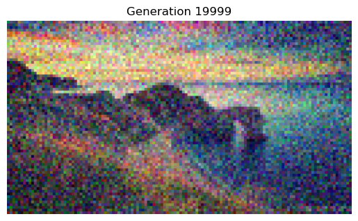
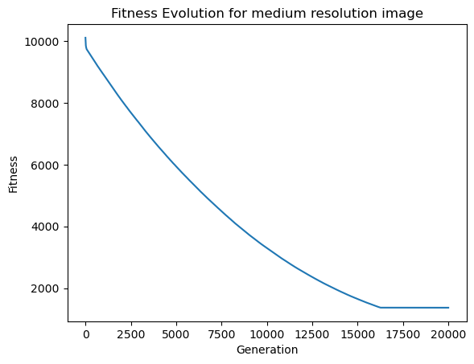

# Global And Multiobjective Optimization Project
_This repository contains the project for the Global And Multiobjective Optimization (2023-2024) course, teached by Professor Luca Manzoni at the University of Trieste_

# Problem statement

The aim of this project is to explore how _genetic algorithms_  can be used 
to recreate lower quality version of a target image. The approach taken here is _pixel based_, that is, they evolve directly the colors of each pixel; _agent based_ methods were not studied. Our goal is to experiment with the following target images:
-  low quality  ($296 \times 296$ resolution) image: [Fenix](Notebooks/Images/FenixDragoon.png)
- a medium quality ($1280 \times 720$ resolution) image: [Nature](Notebooks/Images/nature.png) 
- an high quality ($1920 \times 1080$ resolution)  image: [Birds](Notebooks/Images/birds.png)

# Evolutionary algorithm

### Genotype and phenotyype

Individuals representations are images, of _height_ and _width_ obtained by dividing the original resolution by a $\mathtt{factor}$  hyperparameter. To carry the color information we have the classical Red Green and Blue (RGB) channels that can take any integer value in $[0,255]$.

For the phenotype individuals are upscaled by considering each pixel as an $\mathtt{factor}\times\mathtt{factor}$ block of an image in the original resolution, this allows for a direct computation of the fitness as the Mean Squared Error (MSE) between the individual and the target image.


### Type of genetic algorithm
The genetic algorithm is a _steady state  genetic algorithm_ that substitutes from the population only a constant `replacement_size` of the worst individuals  with the `replacement_size` fitter ones of the new one.

### Selection method
To choose which individuals are allowed to “reproduce”, tournament selection is employed.

### Fitness

As mentioned above, the fitness chosen here is the MSE, let:
- $I_{\text{target}}$: the target image,
- $I_{\text{upscaled}}$: the upscaled individual image,
- $H$: the image height,
- $W$: the image width,
- $C$: the number of color channels (3 for RGB),

then the MSE is calculated as:

$$\text{MSE}(I_{\text{target}}, I_{\text{upscaled}}) = \frac{1}{H \cdot W \cdot C} \sum_{c=1}^{C} \sum_{i=1}^{H} \sum_{j=1}^{W} \left( I_{\text{target}}(i, j, c) - I_{\text{upscaled}}(i, j, c) \right)^2$$

### Crossover

The crossover used is a submatrix crossover: we randomly choose the dimension of a submatrix (bounded by the image resolution) to substitute in _parent 1_ the corresponding submatrix of _parent 2_ and in this process generating a new offspring.

### Mutation

The mutation implementation tried to obtain a “geometric effect” by allowing only for slight changes in the RGB values: between -20 and 20 of the original values for each of the channels. The number of pixels selected for mutations for each individual are given by this formula:

$$\text{num mutations} = \max(1, (\text{height} * \text{width} * \text{mutation rate}))$$

Where _mutation\_rate_ is an hyperparameter given to the algorithm that evolves during the computation following the $1/5$ rule described in [Self-Adjusting Mutation Rates with Provably Optimal Success Rules](https://doi.org/10.1007/s00453-021-00854-3) for discrete spaces in genetic algorithms.

### Hyperparameters

The hyperparameters used for the computations for low/medium images are:

  - factor = 8/10
  - population-size = 100/100
  - generations = 10000/20000 
  - mutation_rate = 0.05/0.05
  - tournament_size = 10/10
  - replacement_size = 30/30
  - c = 1.1/1.1(Rescaling constant used in the 1/5 rule)
  - min_mutation_rate = 0.001/0.001
  - max_mutation_rate = 0.35/0.35

# Results

## Low resolution

<p align="center">
  
   
  
</p>

<p align = "center">
  
</p>

The MSE plot shows that we have basically reached convergence to a local optima at approximately the $10000$ generation, obtaining an image that closely resembles a “pixelated” version of the original one.

## Medium resolution

<p align="center">
  
  
  
</p>

<p align = "center">
  
</p>

It would seem the algorithm isn't capable of escaping the local optima, this can be due to the mutation implementation and lack of diversity of the population in the higher generations. Even if the result is still pretty noisy, the best individual still is a decent representation of a lower quality version of the original image.

## High resolution

Due to the very long computational time (24 hours $\sim$) runs with higher resolution were not yet tested. With similar other hyperparameters, it is expected for the algorithm to take more generations to converge to a local optima since the population size must be reduced due to memory limitations and the search space is larger.


# How to run

You can download the repo and install via [conda](https://anaconda.org/anaconda/conda) the necessary packages by running this command in the terminal once you're in the project directory:

  ```
  conda env create -f env.yml
  ```
Afterwards, you should be able to select the GMO kernel to run the notebooks

